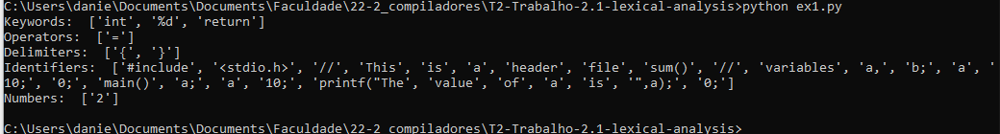

## Resumo Trabalho 2.1

- [Analisador Léxico](/T2-Trabalho-2.1-lexical-analysis/Daniel%20Terra%20Gomes%20-%20T1_%20Trabalho%201.3%20-%20Analisador%20Léxico.pdf)

## How to run

- Testando o **Léxico**

```
python python ex1.py
```

- Sainda **Léxico**


