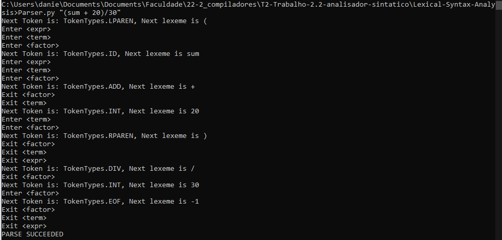

## Resumo Trabalho 2.2

- [Analisador Sintático (Parser)](/T2-Trabalho-2.2-analisador-sintatico/Daniel%20Terra%20Gomes%20-%20T2_%20Trabalho%202.2%20-%20analisador%20sintático.pdf)

## How to run

- Testando o **Parser**

```
python3 Parser.py "(sum + 20)/30"
```

- Sainda **Parser**


